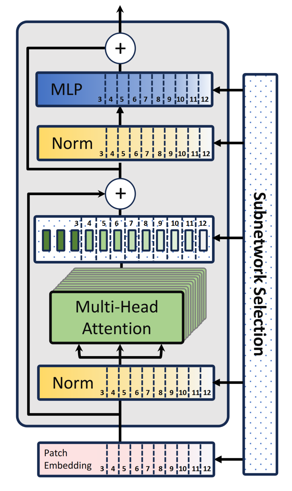

# Scalable Dataset Generation and Feature Extraction for Improved Robustness in High-Traffic Environment Personal Tracker Identification

This repository contains the code, notebooks, datasets links, plots, and evaluation artifacts for my Master thesis at the **Communication Systems Group, Department of Informatics, University of Zurich**.

The thesis extends my Bachelor thesis on BLE tracker identification from **packet-level classification with manually engineered features** to **stream-level classification on raw BLE packet bytes** with scalable Transformer architectures inspired by [HydraViT: Stacking Heads for a Scalable ViT](https://arxiv.org/pdf/2409.17978). The project also reformulates BLE tracker detection as an **open-set classification** problem, where unknown Bluetooth devices are expected at inference time and must be rejected instead of being forced into one of the known tracker classes, following the motivation and evaluation philosophy of [Reducing Network Agnostophobia](https://arxiv.org/pdf/1811.04110).

The **written thesis as a PDF** can be found here:  
[Master Thesis Stefan Richard Saxer.pdf](./Master_Thesis_Stefan_Richard_Saxer.pdf)

Relevant related repositories and datasets:

- [Bachelor thesis repository with Thesis as PDF](https://github.com/stsaxe/Bachelor-Thesis-Stefan-Richard-Saxer)
- [Extended BLE tracker dataset on Kaggle](https://www.kaggle.com/datasets/stefansaxer/ble-packets-from-tracking-devices-extended/data)
- [Original Bachelor thesis dataset on Kaggle](https://www.kaggle.com/datasets/stefansaxer/ble-packets-from-tracking-devices)

## Repository map

| Path | Contents |
|---|---|
| [`ble`](./ble) | BLE Parser Framework for parsing, masking, validating, and synthetically generating BLE packets |
| [`bpe`](./bpe) | Custom Byte-Pair Encoder for BLE packet byte sequences |
| [`data_generation`](./data_generation) | Notebooks and YAML configurations for synthetic BLE packet generation |
| [`data_masking`](./data_masking) | Notebooks and YAML configurations for deterministic and randomized masking of BLE packet fields |
| [`data_processing`](./data_processing) | Data-processing notebooks and helper functions for converting captured packets into modeling datasets |
| [`evaluation_framework`](./evaluation_framework) | Custom framework for open-set and closed-set evaluation metrics |
| [`executors`](./executors) | Custom executors used inside Task-Group-Framework pipelines |
| [`modeling`](./modeling) | HydraBLE Transformer implementation, training notebooks, logits extraction, and evaluation notebooks |
| [`nrf`](./nrf) | Nordic Semiconductor sniffer code used for BLE packet capture, with small fixes and updates |
| [`open_set_example`](./open_set_example) | MNIST-based example explaining open-set classification and Entropic Open-Set Loss |
| [`out`](./out) | Main generated artifacts: plots, tables, and selected serialized objects |
| [`plotting`](./plotting) | Plotting helpers and reusable plotting pipelines |
| [`tgf`](./tgf) | Task-Group-Framework implementation reused and extended from the Bachelor thesis |
| [`environment.yml`](./environment.yml) | Conda environment definition |
| [`LICENSE.md`](./LICENSE.md) | Apache 2.0 license |

The data folder is not part of this GitHub repository because the PCAP, CSV, and processed Parquet datasets are too large. To execute the notebooks locally, download the extended dataset from Kaggle and place the extracted `data` folder in the top-level repository directory. Local execution requires **Python 3.12 or later**. The conda environment is defined in [`environment.yml`](./environment.yml).

## Project overview

| Area                   | Summary                                                                                                          |
|------------------------|------------------------------------------------------------------------------------------------------------------|
| Problem                | Robust identification of BLE tracking devices in high-traffic environments                                       |
| Previous baseline      | Bachelor thesis: packet-level classification with manually extracted BLE features                                |
| Main extension         | Stream-level classification on raw byte sequences extracted from BLE packets                                     |
| Model family           | HydraBLE: scalable Transformer architecture inspired by [HydraViT](https://arxiv.org/pdf/2409.17978)             |
| Classification setting | Open-set classification with unknown-device rejection                                                            |
| Dataset                | More than 10 million real-world packet samples from more than 20 BLE devices                                     |
| Additional data        | Synthetic BLE packet and stream generation, including DULT-style tracker samples                                 |
| Main artifacts         | BLE Parser Framework, masking system, synthetic generation system, BPE tokenizer, HydraBLE, Evaluation Framework |
| Evaluation             | OSCR curves, CCR at fixed FPR, closed-set/micro/macro/binary accuracy, confusion matrices                        |
| BLE Tracker Analysis   | First technical analysis of the Apple AirTag 2 and its new Apple Find My Protocl implementation                  |

## Technical background

Personal BLE trackers such as AirTags, SmartTags, Tile trackers, and Google Find My Hub-compatible trackers do not rely on GPS and cellular connectivity in the same way as traditional GPS trackers. Instead, they periodically broadcast BLE advertising packets. Nearby finder devices, typically smartphones participating in the same tracking ecosystem, receive these advertisements and help upload encrypted location reports to the vendor's backend.

This creates a passive detection opportunity. A hidden tracker is difficult to find physically, but it still has to emit BLE advertisements to be locatable by its tracking network. The core idea is therefore to classify BLE traffic and detect whether a stream of packets belongs to a potentially privacy-invasive tracker.

This thesis uses a broad definition of a BLE tracker: any device that is trackable through a Bluetooth-based tracking network. This includes dedicated tags such as AirTags, but also devices such as iPhones when they participate in a Bluetooth-based tracking ecosystem.

## From the Bachelor thesis to this Master thesis

The Bachelor thesis demonstrated that BLE tracker detection is possible in high-traffic environments, but the approach had several limitations:

| Bachelor thesis | Master thesis |
|---|---|
| Packet-level classification | Stream-level classification |
| Manually extracted Wireshark/CSV features | Raw-byte packet modeling |
| MLP, , decision tree | Scalable Transformer architecture |
| Mostly closed-set evaluation | Open-set evaluation with unknown-device rejection |
| Limited number of tracker devices | Expanded physical dataset with more than 20 BLE devices |
| Feature engineering by analysis | Automatic deep feature extraction from byte sequences |
| Basic unknown handling through an "other device" class | Entropic Open-Set Loss and threshold-based rejection |
| Small models with thousands of parameters | HydraBLE models with millions of parameters and adaptive inference scale |

The goal of this thesis is not merely to improve closed-set accuracy. The more important objective is robustness: a real-world BLE tracker detector must handle devices that were not present during training and should avoid constantly misclassifying unknown background devices as trackers.

## Why stream-level classification?

A BLE device is not represented well by a single packet. A tracker emits a sequence of packets over time, and the sequence contains information that an isolated packet may not capture. For example:

- packet ordering can be informative,
- bursts and dormant periods can be class-specific,
- inter-packet time deltas encode behavior,
- channel sequences can matter,
- some devices emit multiple structurally different packet types,
- a physical device can rotate BLE source addresses.

In the Bachelor thesis, device-level classification had to be approximated by classifying individual packets and aggregating packet predictions per source address. The Master thesis instead models packet **streams** directly. A stream is a time-ordered sequence of packets from the same source observed within a bounded time window and physical context.

This shift changes the modeling problem fundamentally. A packet can be represented as a flat feature vector, but a stream is a sequence. That makes sequence-aware architectures such as Transformers much more appropriate.

## Why raw-byte modeling?

The Bachelor thesis used manually engineered BLE features such as PDU type, company identifiers, service UUIDs, manufacturer-specific data length, and packet-rate features. This worked well, but it does not scale cleanly:

- every new protocol variant may require new feature engineering,
- Wireshark-based CSV extraction is not ideal for deployment,
- manual feature design requires extensive domain analysis,
- feature extraction may become expensive on constrained edge devices,
- unknown future trackers may use packet fields not anticipated by the feature set.

This thesis therefore moves toward raw-byte modeling. Packets are represented as byte sequences extracted from PCAP data. The model then learns useful features automatically.

However, raw-byte modeling introduces two important technical challenges:

1. **Tokenization.** Raw bytes are not fed directly as bits. They are tokenized and embedded. The repository includes a custom Byte-Pair Encoder in [`bpe`](./bpe) so frequent adjacent byte patterns can become meaningful merged tokens.

2. **Shortcut prevention.** A model trained on raw bytes may learn misleading identifiers such as source addresses or quasi-static payload fields. The BLE Parser Framework therefore supports configurable masking and deterministic randomization of packet fields before tokenization and training.

## BLE Parser Framework

The BLE Parser Framework in [`ble`](./ble) is one of the central software artifacts of the thesis. It provides a structured way to parse, validate, mask, and generate BLE packets.

Main architectural features:

| Component | Purpose |
|---|---|
| Parser interface | Converts raw BLE packet bytes into structured parser trees |
| Field abstraction | Represents packet fields as typed components |
| Node/path system | Enables addressing packet subfields for masking and generation |
| Parse policies | Controls how strictly BLE specification rules are enforced |
| Auto-discovery | Allows parser components to be discovered and composed dynamically |
| Masking system | Replaces or randomizes selected fields to prevent shortcut learning |
| Synthetic generation | Builds syntactically valid BLE packets from YAML-defined state spaces |

This framework is useful beyond this thesis because it separates BLE packet structure from model architecture. It can be used for classical preprocessing, deep-learning input preparation, privacy-preserving masking, adversarial masking, and synthetic packet generation.

## Masking

Masking is necessary because raw network traffic contains fields that can be predictive in the dataset but meaningless or harmful in real-world deployment.

A simple example is a BLE source address. If a tracker is captured for 12 hours and its address does not rotate during that period, a model could memorize that source address instead of learning the packet structure of the tracker. That would inflate test performance while harming real-world generalization.

The masking system supports:

- deterministic randomization (even across treads and processes),
- non-deterministic masking across epochs,
- YAML-defined masking rules,
- field-level matching through the parser path system,
- masking of addresses and other dynamic fields,
- masking policies that can be reused across datasets and experiments.

The corresponding notebooks and configurations are in [`data_masking`](./data_masking).

## Synthetic BLE packet generation

The thesis also introduces state-space-based synthetic BLE packet generation. Instead of only relying on manually collected physical tracker data, the parser framework can generate syntactically valid BLE packets from YAML configurations.

This is used to expand training data and to simulate DULT-style packets for trackers that may not yet be available physically. The relevant code and notebooks are in [`data_generation`](./data_generation).

Synthetic generation is especially useful for open-set classification because robust unknown rejection requires exposure to diverse non-target or adversarial-like samples during training and validation.

## HydraBLE Transformer

The central model architecture is **HydraBLE**, a scalable Transformer for BLE packet-stream classification. It adapts the scalable-subnetwork idea from [HydraViT: Stacking Heads for a Scalable ViT](https://arxiv.org/pdf/2409.17978) to the BLE domain. HydraViT trains a universal Transformer in which subnetworks with different numbers of attention heads can be selected at inference time. HydraBLE transfers this idea from image patches to tokenized BLE packet streams.

HydraBLE differs from the Bachelor thesis models in several ways:

| Aspect | HydraBLE |
|---|---|
| Input | Streams of tokenized BLE packet bytes |
| Sequence type | Ordered packet sequences with packet-level structure |
| Feature extraction | Learned by the model rather than manually engineered |
| Architecture | Transformer-based sequence model |
| Scalability | Supports multiple inference scales through the HydraBLE parameter `h` |
| Training | One model can support several runtime-complexity settings |
| Evaluation | Open-set evaluation with unknown rejection |

The scalable ViT architecture of HydraViT (and in extension HydraBLE with some modifications to the embedding layer) is shown in the image below taken from [HydraViT: Stacking Heads for a Scalable ViT](https://arxiv.org/pdf/2409.17978).

  

The architecture of HydraBLE and the trainer classes are implemented in:

- [`modeling/HydraBLE.py`](./modeling/HydraBLE.py)
- [`modeling/Trainer.py`](./modeling/Trainer.py)
- [`modeling/PreTrainingTrainer.py`](./modeling/PreTrainingTrainer.py)

The thesis evaluates several HydraBLE settings with `h ∈ {1, 2, 4, 8}`. Intuitively, these settings represent different runtime/model-scale configurations. This is important because a practical BLE tracker detector may run on edge hardware with different compute budgets.

## Open-set classification

A closed-set classifier assumes that every test sample belongs to one of the classes seen during training. This is unrealistic for BLE traffic. In practice, a detector will observe many unknown devices: phones, headphones, laptops, watches, IoT devices, and future trackers that were not part of the training set.

This thesis therefore treats BLE tracker detection as an open-set classification problem. The model must do two things:

1. classify known tracker classes correctly,
2. reject unknown devices instead of forcing them into a known tracker class.

The open-set setup is based on [Dhamija, Günther, and Boult — *Reducing Network Agnostophobia*](https://arxiv.org/pdf/1811.04110). That paper argues that ordinary softmax thresholding and a single background class are often insufficient for previously unseen classes, introduces **Entropic Open-Set Loss** and **Objectosphere Loss**, and proposes OSCR-style evaluation for comparing known-class accuracy against false positives on unknown samples.

This thesis uses the **Entropic Open-Set Loss** function for parameter optimization. Known samples are trained with standard one-hot targets. Unknown samples are trained with a uniform target distribution over known classes, encouraging the model to output low-confidence predictions for unknowns. At inference time, samples can be rejected as unknown if the maximum softmax score is below a threshold.

This is a natural fit for BLE tracker detection: a robust detector should recognize known tracker families, but it should also avoid confidently misclassifying unrelated background BLE devices as malicious trackers.

## Evaluation metrics

Closed-set accuracy and confusion matrices are still useful for intuition, but they are not sufficient for open-set classification. The key metric family used here is based on the **Open Set Classification Rate (OSCR)** curve.

| Metric | Meaning |
|---|---|
| FPR | Fraction of unknown samples incorrectly accepted as known |
| CCR | Correct classification rate of known samples |
| CCR @ FPR = 1e-1 | Known-class accuracy when allowing 10% false positives among unknowns |
| CCR @ FPR = 1e-2 | Known-class accuracy when allowing 1% false positives |
| CCR @ FPR = 1e-3 | Known-class accuracy when allowing 0.1% false positives |
| OSCR curve | Trade-off curve between known-class classification and unknown rejection |

For BLE tracker detection, low false-positive rates are particularly important. A detector that repeatedly flags normal background BLE devices as malicious trackers would likely be ignored or disabled by users.

The custom evaluation code is in [`evaluation_framework`](./evaluation_framework). The evaluation framework offers many well-tested closed-set and open-set metrics for robust evaluation of models.

## Results

The final evaluation compares several HydraBLE variants against a baseline inspired by the Bachelor thesis. The main evaluation metric is the OSCR curve and the corresponding CCR at fixed FPR values. Confusion matrices are provided for interpretability.

### Summary of reported metrics

| Experiment | Most relevant h scale | Micro accuracy | Macro accuracy | Binary accuracy | CCR @ FPR = 1e-2 | CCR @ FPR = 1e-3 | Metrics table |
|---|----------------------:|---:|---:|---:|---:|---:|---|
| HydraBLE hard |               `h = 2` | 0.971 | 0.946 | 0.999 | 0.943 | 0.943 | [`Metrics Table HydraBLE (hard).csv`](./out/tables/modeling/classification_hard/Metrics%20Table%20HydraBLE%20(hard).csv) |
| HydraBLE augmented |               `h = 8` | 0.981 | 0.970 | 0.993 | 0.970 | 0.923 | [`Metrics Table HydraBLE (augmented).csv`](./out/tables/modeling/classification_data_augmented/Metrics%20Table%20HydraBLE%20(augmented).csv) |
| HydraBLE fine-tuning |               `h = 8` | 0.979 | 0.965 | 0.992 | 0.964 | 0.882 | [`Metrics Table HydraBLE (finetuning).csv`](./out/tables/modeling/classification_finetuning/Metrics%20Table%20HydraBLE%20(finetuning).csv) |

The table above only shows one value of h for each experiment. The experiments differ in the dataset used only. The "hard" experiment used an unmasked-time interval, which results in overfitting. The "augmented" experiment used data augmentations, such as time distortion, and the "finetuning" experiment uses variable sequence lengths to better represent real world inference settings.  

The Bachelor thesis baseline performs substantially worse on the new and more difficult benchmark. In particular, the baseline struggles with the AirTag 2 and cannot reliably distinguish DULT states because the original packet-level feature approach does not inspect the raw payload in the way required for this task.

### Main result plots

The main result artifacts are available under [`out/plots/modeling`](./out/plots/modeling).

Useful sub-folders are :

| Folder | Contents |
|---|---|
| [`out/plots/modeling/classification_hard`](./out/plots/modeling/classification_hard) | Hard HydraBLE setup |
| [`out/plots/modeling/classification_data_augmented`](./out/plots/modeling/classification_data_augmented) | HydraBLE with data augmentation |
| [`out/plots/modeling/classification_finetuning`](./out/plots/modeling/classification_finetuning) | Fine-tuned HydraBLE with variable-length sequences |
| [`out/plots/modeling/BA`](./out/plots/modeling/BA) | Bachelor thesis baseline on the new benchmark |

### The OSCR curve for HydraBLE with finetuning compared against the Baseline of the Bachelor thesis (Approach BA)

**Note that the ideal curve is a flat line at CCR = 1.0 for this OSCR curve metric**

  

### A Confusion matrix for fine-tuned HydraBLE with h = 8 (the largest and strongest variant of HydraBLE)

  

## First technical analysis of Apple's AirTag 2 

Another major non-modeling contribution of this thesis is the first detailed analysis of the **2nd-generation Apple AirTag**. At the time of writing, the AirTag 2 had only recently appeared on the market, and the thesis treats its packet-level behavior as one of the central scientific contributions.

The main findings are:

| Finding | Technical interpretation |
|---|---|
| AirTag 2 preserves the original AirTag-style unpaired behavior | In the `unpaired` state, AirTag and AirTag 2 packets are structurally similar and still use Apple Continuity fast-pairing style manufacturer-specific payloads. |
| AirTag 2 still uses a high-rate pairing burst | After first startup/reset, AirTag 2 shows the same short-lived high packet-rate burst of roughly 30 packets per second for about 600 seconds, likely to simplify pairing. |
| AirTag 2 introduces a new DULT-compatible packet type | In the `lost` state, AirTag 2 emits a packet carrying Service Data with UUID `0xFCB2`, the DULT UUID used for unwanted-location-tracker detection. |
| AirTag 2 uses Apple network metadata inside DULT packets | The leading DULT payload byte `0x01` is interpreted as Apple's network ID; the following owner-state byte indicates whether the tracker is near its owner. |
| AirTag 2 keeps backward compatibility | In the `lost` state, the tracker advertises both legacy Apple Find My / Continuity-style packets and DULT-style packets, making it compatible with older Apple Find My devices while also supporting DULT. |
| AirTag 2 changes nearby-state behavior substantially | In the `nearby` state, it sends only DULT-compatible packets, strips the public key from the payload, and sets the near-owner bit. |
| Older Apple devices did not show the same DULT behavior in the thesis captures | The thesis verified that an iPhone 11 Pro on iOS 26.4 and an original AirTag on firmware 2.0.73 did not advertise DULT-conforming Find My packets in the same way. |

Relevant AirTag 2 analysis plots can be found here: [`out/plots/tracker_analysis/Apple AirTags`](./out/plots/tracker_analysis/Apple%20AirTags)

## Main technical contributions

1. **Stream-level BLE tracker classification**  
   The thesis moves from classifying isolated packets to classifying packet streams, making the task closer to device-level classification.

2. **Raw-byte modeling of BLE traffic**  
   The models operate on byte-level packet data extracted from PCAP files instead of manually engineered CSV features.

3. **HydraBLE Transformer**  
   A scalable Transformer architecture for BLE stream classification that can adapt computational complexity at inference time.

4. **Open-set BLE tracker detection**  
   The classification task is modeled and evaluated under the assumption that unknown devices exist at inference time.

5. **BLE Parser Framework**  
   A reusable parsing, masking, validation, and generation framework for BLE packets.

6. **Masking and shortcut prevention**  
   Configurable field-level masking prevents models from memorizing irrelevant identifiers and dynamic fields.

7. **Synthetic BLE packet generation**  
   YAML-configured state-space generation expands the dataset and supports DULT-style synthetic samples.

8. **Expanded BLE tracker dataset**  
   The dataset contains more than 10 million real-world packet samples from more than 20 BLE devices.

9. **First analysis of Apple AirTag 2**  
   The thesis presents a packet-level analysis of Apple AirTag 2, identifies its DULT-compatible packets with UUID `0xFCB2`, and highlights its backward-compatible dual advertising behavior.

10. **Evaluation Framework**  
   A custom open-set evaluation framework computes OSCR curves, CCR at fixed FPR values, confusion matrices, and related metrics.

## License

This repository is released under the [Apache License 2.0](./LICENSE.md).

## Author

**Stefan Richard Saxer**  
Master thesis, University of Zurich  
Department of Informatics, Communication Systems Group  
Supervisors: Katharina O.E. Müller and Prof. Dr. Burkhard Stiller  
Date of submission: April 24, 2026
